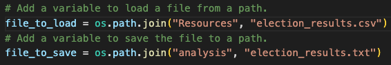
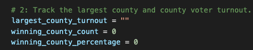

# Election Analysis

## Overview of Election Audit
A Colorado Board of Elections emoloyee has requested the following tasks to complete the election audit of a recent local congressional election. 

1. Calculate the total number of votes cast.
2. Get a complete list of candidates who received votes.
3. Calculate the total number of votes each candidate received.
4. Calculate the precentage of votes each candidate won.
5. Determine the winner of the election based on popular vote.
6. Calculate the vote turnout for each county.
7. Calculate the percentage of votes from each county out of the total count.
8. Calculate the county with the highest turnout.

## Resources 
- Data Source: election_results.csv
- Software: Python 3.9.12, Visual Studio Code, 1.72.2

## Election Audit Results
The analysis of the election show that: 
- There were 369,711 votes cast in the election.
- The candidates were:
    - Charles Casper Stockham
    - Diana DeGette
    - Raymon Anthony Doane
- The candidate results were: 
    - Charles Casper Stockham received 23.0% of the vote and 85,213 number of votes.
   - Diana DeGette received 73.8% of the vote and 272,892 number of votes.
   - Raymon Anthony Doane received 3.1% of the vote and 11,606 number of votes.
- The winner of the election was: 
    - Diana DeGette, who received 73.8% of the vote and 272,892 number of the vote.
- Denver County had the largest number of votes.
    - Jefferson received 10.5% of the vote and 38,855 number of votes.
    - Denver received 82.8% of the vote and 306,055 number of votes.
    - Arapahoe recevied of the vote 6.7% and 24,801 number of votes.

## Election Audit Summary
The python script used for this audit can be modifyed for any future elections by updating the dependencies. Examples below.

- Example 1: Update the import path with new dependency files:

- Example 2: For a national election, switch out county named variables, and insert the word state:

